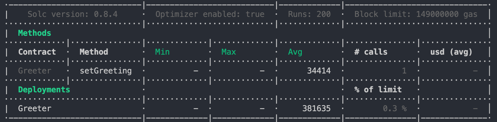
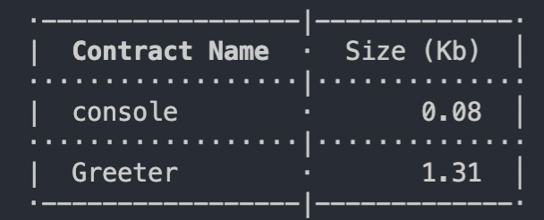

## Hardhat Template for TypeScript and Integration Full-Stack

Before to Start

---

### Validate Develop Environment

---

- Node v14.17.4 or +
- Nvm v0.37.0 or +
- Solc v0.8.4 or +
- Svm from github repo [Solidity Version Manager](https://github.com/josh-richardson/svm).
- Hardhat v2.2.1 or +
- Ganache-cli v2.13.2 or +
- Ethers.js v5.3.0 or +

### Start migration

---

```
npx hardhat run scripts/deploy.ts
```

OR

```
npm run deploy
```

---

#### Start Hardhat test

---

```
npx hardhat test
```

---

#### environment variables (.env file)

---

- MNEMONIC=
- INFURAKEY=
- PRIVATE_KEY=
- COINMARKETCAP_API_KEY=
- ETHERSCAN_API_KEY=
- BSCSCAN_API_KEY=
- URL_BSC=<https://bsc-dataseed1.binance.org>
- URL_TESTNET_BSC=<https://data-seed-prebsc-1-s1.binance.org:8545>
- URL_MOONBEAM_TESTNET=<https://rpc.testnet.moonbeam.network>

##### Generate a MNEMONIC

##### Install global mode ganache-cli

 For generate a MNEMONIC and PRIVATE_KEY constants, only need to install and run:

 ```
 npm install --save-dev ganache-cli
 ganache-cli
 ```

---

### Last ETH Gas Reporter

---

- Simulation for basic methods



---

### Last Contract Size Reporter

---


---
